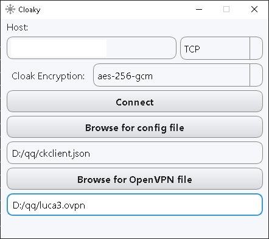

# Cloaky
A Qt interface on top of cloak project to make it easier for basic users with the ability to set the OpenVPN settings and cloak in an one solution integrated manner

A compiled version of Cloaky has been tested on Windows 10 and is expected to work on Windows 8 and later versions.

The OpenVPN installer is bundled in the zip file, so users do not need to download it separately, even if they have limited internet access.

Before using Cloaky, the community version of OpenVPN must be installed on the system.

To use Cloaky, users will need two files: a config.json file that deals with the cloak server and an OpenVPN file for that particular server. With one click, Cloaky will set everything up based on the information in the config.json file.

for creating config file you must establish a server with cloak + openvpn, here is the tutorial for it and then generate the config based on the server

https://web.archive.org/web/20221202212001/https://www.oilandfish.com/posts/openvpn-cloak.html

Cloaky interface:

Installation
Download the zip file containing the compiled version of Cloaky.
Extract the contents of the zip file to a directory of your choice.
Install the community version of OpenVPN on your system if it is not already installed.
Load the two required files (config.json and the OpenVPN file) into the Cloaky interface.
Run Cloaky and click the button to set everything up based on the information in the config.json file.
Usage
Cloaky requires the two files mentioned above to work. The config.json file contains information about the cloak server, while the OpenVPN file provides the information needed to connect to the server. With these two files in place, Cloaky can be used to quickly and easily set up a connection to the cloak server with just one click.

## Download

The compiled version of Cloaky is available for download on Github. You can download it by clicking on the following link:

[Download Cloaky](https://github.com/certifiedmango/Cloaky/releases)

This project makes use of the following open-source projects:

- Cloak: https://github.com/cbeuw/Cloak
- OpenVPN: https://github.com/OpenVPN/openvpn-gui

We would like to extend our gratitude to the developers and contributors of these projects.

